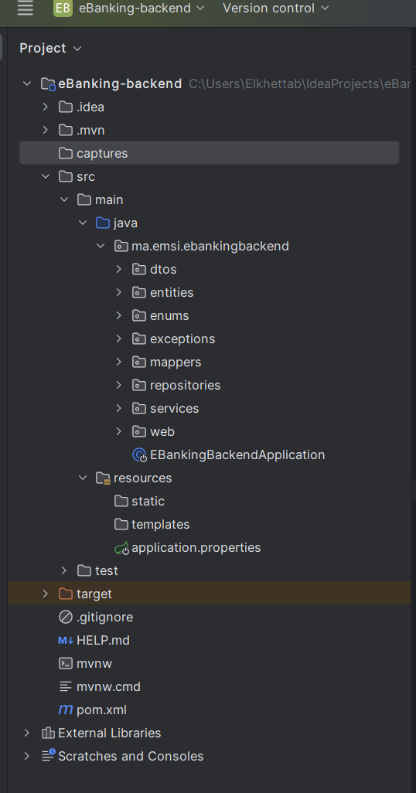
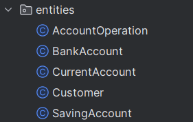
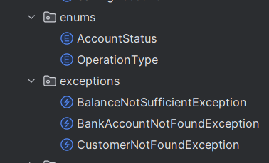
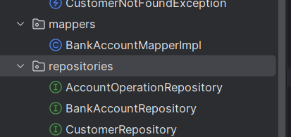
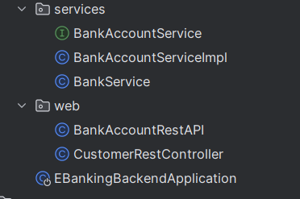
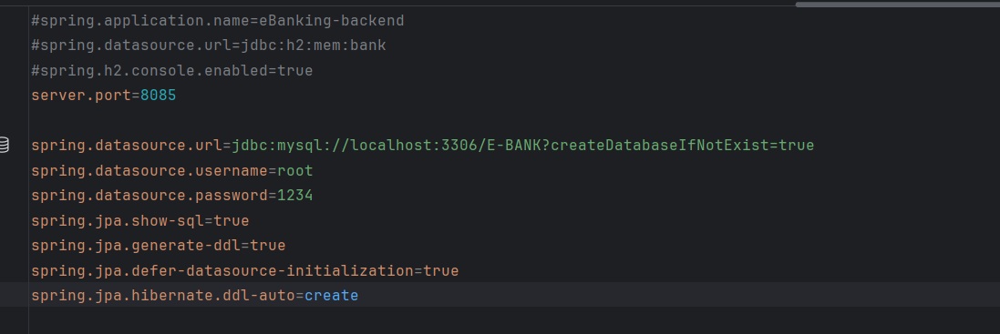
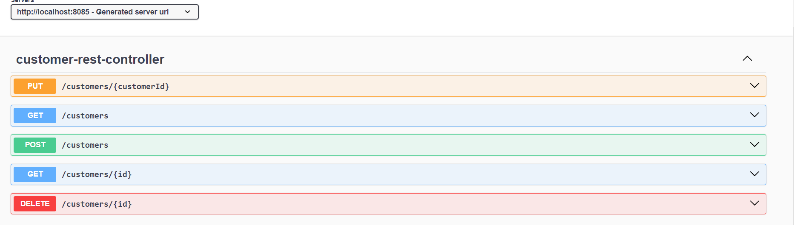
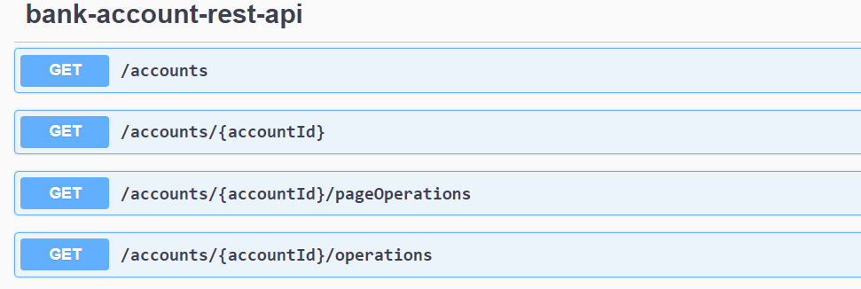
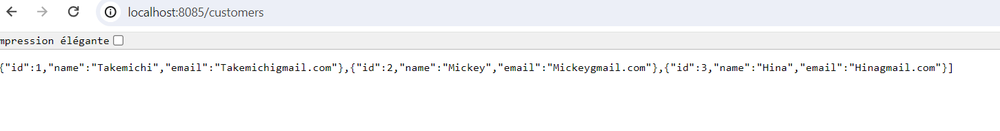
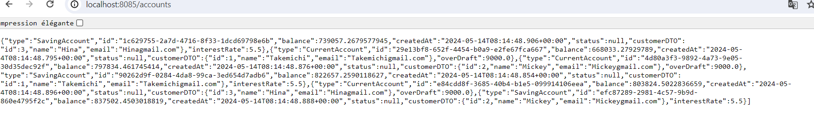

<h1>Projet Digital Banking</h1>
<h2>Objectif du projet:</h2>

Création d'un projet Spring Angular concernant E-Banking en créant la partie 
le backend le frontend et la partie sécurité.

<h2>Partie Backend</h2>
<h3>Architecture de la partie backend:</h3>

<h3>Les entités:</h3>

<h3>Les dtos:</h3>

Les dtos sont utilisés pour ne pas intégrer directement les entités dans le fontend

<h3>Les enums et les exceptions:</h3>

<h3>Les mappers et repositories:</h3>

mappers contient les fonctions du transfer entre l'entité et la dto.

<h3>Les services, partie web(controllers) et la partie test:</h3>

Les services contiennent les fonctionnalités avec leur implémentation.
Web contient le controleur du partie Bank et controleur pour partie Customer.
Partie test Création de notre data.

<h3>Utilisation du mysql pour le stockage:</h3>

<h3>Test de la partie backend avec Swagger:</h3>
<h4>Customer test</h4>

<h4>Bank account test</h4>

<h3>Affichage customers</h3>

<h3>Affichage accounts </h3>

